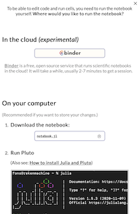

# How to use this site

You can read through the Pluto notebooks hosted here, but the only way to become familiar with a language is to try it.  You have three options:

1. run notebooks on binder.  Only requires a web browser, but starting a virtual machine on binder is **sloooowww**.
2. run notebooks locally.  Only requires installing Julia and Pluto locally.  Download and open the notebook to start playing with.
3. try code in a Julia REPL.  Only requires installing Julia. You can copy and paste code from the online notebook into your REPL. Normally, you would also want to use a text editor, so in practice should also install Visual Studio Code with the Julia extension.

## How to do it

The first two options are explained in the link you'll see at the top right of each notebook.  It looks like this:

Follow that link to see how to run the notebook on binder, or how to install Pluto and run the notebook locally.  The instructions look like this (thumbnail linked to full-sized image):

The third option is to install Julia and 

